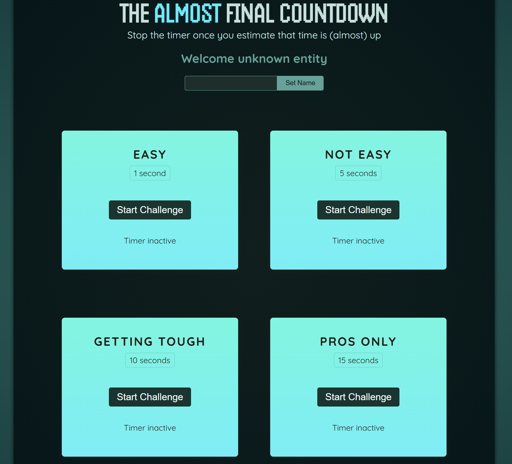
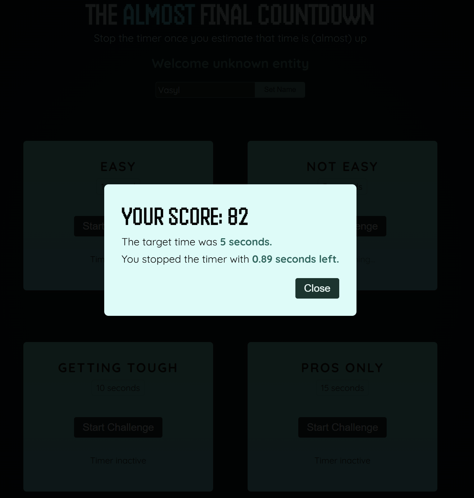

# ⏱️ Timer Challenge

A React-based interactive game where players test their timing precision by stopping a countdown timer as close to the target time as possible. Perfect for high-precision skill development and demonstrating React's advanced features like refs and hooks.

---

## 🚀 [Live Demo](https://timer-challenge-one.vercel.app/)

## 📸 Screenshots

### Homepage


_Main interface showing all available timer challenges at different difficulty levels._

### Game Over


_Result modal displaying the player's score and accuracy after completing a timer challenge._

---

## 🎮 Features

- **Multiple Difficulty Levels**: Four increasingly challenging timer targets
  - Easy: 1 second
  - Not easy: 5 seconds
  - Getting tough: 10 seconds
  - Pros only: 15 seconds

- **Interactive Gameplay**:
  - Start/Stop controls for each challenge
  - Real-time countdown display
  - Precision scoring system
  - Reset functionality

- **Modern React Stack**: Built with React 19 and Vite for optimal performance
- **Responsive Design**: Clean, accessible UI that works across devices
- **ESLint Configured**: Built-in code quality checks

## 🛠️ Tech Stack

- **Frontend**: React 19
- **Build Tool**: Vite
- **Language**: JavaScript (ES6+)
- **Styling**: CSS3
- **Linting**: ESLint with React plugins
- **Package Manager**: npm

## 📋 Prerequisites

- Node.js (v14 or higher)
- npm or yarn

## 🚀 Installation

1. Clone the repository:

```bash
git clone https://github.com/vasylpryimakdev/timer-challenge.git
cd timer-challenge
```

2. Install dependencies:

```bash
npm install
```

## 🎯 Getting Started

### Development Mode

Start the development server with hot module replacement:

```bash
npm run dev
```

The app will open at `http://localhost:5173`

### Production Build

Create an optimized production build:

```bash
npm run build
```

### Preview Production Build

Preview the production build locally:

```bash
npm run preview
```

### Code Quality

Run ESLint to check for code quality issues:

```bash
npm run lint
```

## 📁 Project Structure

```
timer-challenge/
├── src/
│   ├── components/
│   │   ├── Player.jsx           # Player information component
│   │   ├── TimerChallenge.jsx   # Main timer challenge component
│   │   └── ResultModal.jsx      # Result display modal
│   ├── App.jsx                  # Main application component
│   ├── index.css                # Global styles
│   └── main.jsx                 # React entry point
├── public/                      # Static assets
├── package.json                 # Project configuration
├── vite.config.js              # Vite configuration
├── index.html                  # HTML template
└── README.md                   # This file
```

## 🎨 Component Overview

### Player Component

Displays player information and statistics.

### TimerChallenge Component

The core game component that:

- Manages timer state using `useState` hook
- Uses `useRef` to access DOM elements directly
- Handles timer start/stop logic
- Manages challenge completion

### ResultModal Component

Presents game results and allows users to:

- View their score
- Restart the challenge
- Track performance

## 🎮 How to Play

1. Select a difficulty level (Easy, Not easy, Getting tough, or Pros only)
2. Click "Start Challenge" to begin the countdown
3. Try to stop the timer as close to the target time as possible
4. Click "Stop Challenge" when you think the time is right
5. View your result and see how accurate you were
6. Retry to improve your score

## 📊 Scoring

The closer you stop the timer to the target time, the better your score. The application provides immediate feedback on your timing accuracy through the result modal.

## 🔧 Development

### Available Scripts

| Command           | Purpose                  |
| ----------------- | ------------------------ |
| `npm run dev`     | Start development server |
| `npm run build`   | Build for production     |
| `npm run preview` | Preview production build |
| `npm run lint`    | Run ESLint checks        |

### Code Style

This project follows React best practices and ESLint configurations. Before committing, ensure all linting checks pass:

```bash
npm run lint
```

## 🚀 Performance

- Built with Vite for lightning-fast development and production builds
- React 19 for optimal performance and latest features
- Minimal bundle size with tree-shaking support

## 📝 License

MIT

## 🤝 Contributing

Contributions are welcome! Please feel free to submit a Pull Request.

## 📧 Support

For support, open an issue in the repository or contact the development team.

---

**Enjoy the Timer Challenge! ⏱️**
